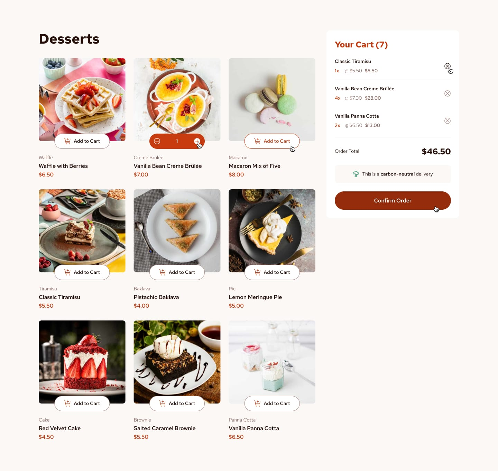

  
  <h1>Frontend Mentor - Product list with cart</h1>
  <a href="https://www.frontendmentor.io/challenges/product-list-with-cart-5MmqLVAp_d"><strong>Frontend Mentor Challenge</strong></a>

 

  <!-- Profiles -->
  

  <!-- Status -->
   &nbsp;&nbsp;&nbsp;

 
 

  <h2>Preview</h2>
  
  
Design preview for the Product list with cart challenge.

 

## Links

|||
| :----- | :----- |
| Solution URL: | [Frontend Mentor - Product list with cart](https://www.frontendmentor.io/solutions/product-list-with-cart-vG2KKtoU2Y) |
| Live Site URL: | <a target href="https://jvssvj.github.io/Product-List-With-Cart/index.html" target="_blank">Product list with cart</a>
|||

 
 

## The Challenge

Users should be able to:
- Add items to the cart and remove them
- Increase/decrease the number of items in the cart
- See an order confirmation modal when they click "Confirm Order"
- Reset their selections when they click "Start New Order"
- Navigate the whole project and perform all actions using only their keyboard
- View the optimal layout for the interface depending on their device's screen size
- See hover and focus states for all interactive elements on the page

 

  <h3>Languages ​​and tools used🛠️</h3>
  <!--HTML5-->       

 

  <h3 align="center">Connect with me 🔗:</h3>
  <!--FreecodeCamp--><a href="https://www.freecodecamp.org/jvssvj7" target="_blank" rel="noreferrer"> 
  <!--Frontend Mentor-->
  <!--Linkedin-->
  <!--Instagram-->

